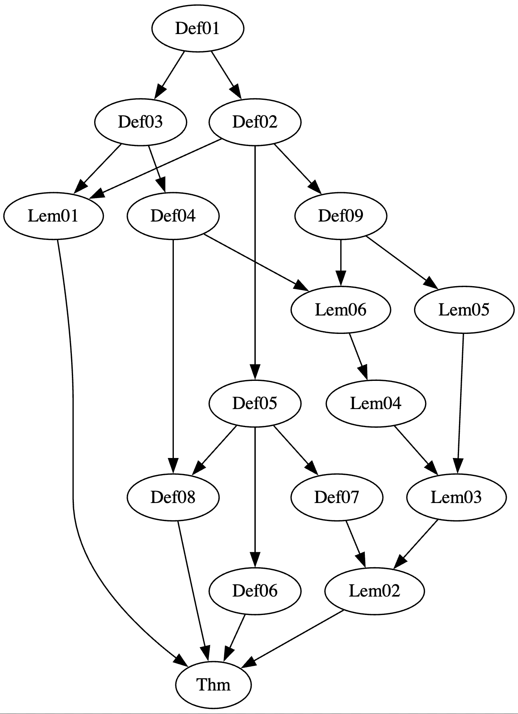

# Formal Verification of Top Single Layer

Formal verification project for the Top Single Layer (TSL) encoding method from the paper “At the Top of the Hypercube — Better Size-Time Tradeoffs for Hash-Based Signatures” (ePrint 2025/889).

Formal security proofs of TSL are written in Lean 4.

Paper: https://eprint.iacr.org/2025/889

## Proof Status

The following table tracks the progress of formal verification of the TSL encoding method.  

| Statement | Progress |
|----|----|
| TSL encoding $f$ is incomparable. | ✅ Done |
| $f$ is $\epsilon$-secure against target collision resistance. | 🏗️ WIP |

## Dependency Graph

The main theorem `Thm` holds if both Lemma 1 `Lem1` and Lemma 2 `Lem2` are true.

The formal proof of Lemma 1 is complete, while Lemma 2 is still in progress.

